<!-- ========================================= -->
<!--              AYUSH.OS PROFILE             -->
<!-- ========================================= -->

<p align="center">
  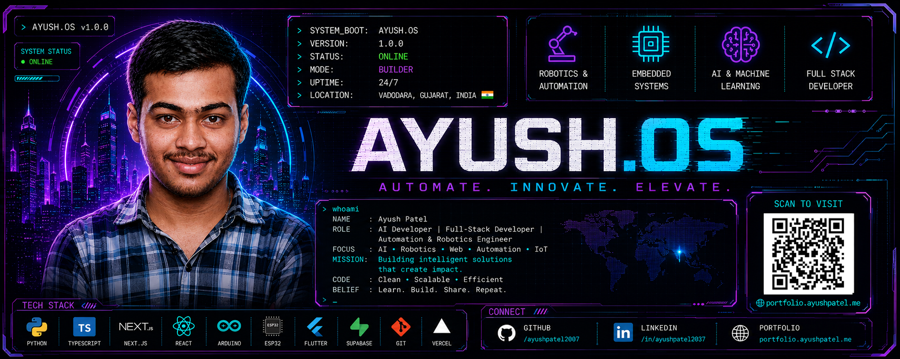
</p>

<h1 align="center">
AYUSH.OS
</h1>

<h3 align="center">
AI Developer • Full-Stack Developer • Automation & Robotics
</h3>

<p align="center">


</p>

---

<p align="center">
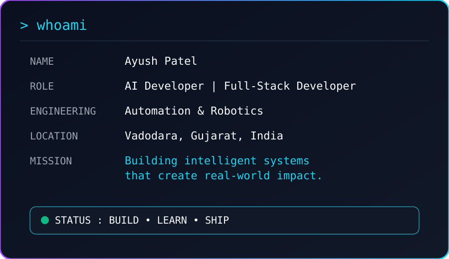
</p>

---

# 👋 About Me

```bash
> whoami

Name        : Ayush Patel

Role        : AI Developer

Education   : Diploma in Automation & Robotics

Location    : Gujarat, India

Portfolio   : portfolio.ayushpatel.me

Mission     : Build AI-powered products that solve
              real-world problems.
```

---

# 🚀 Current Focus

- 🤖 Artificial Intelligence

- 💻 Full-Stack Development

- ⚡ Automation & Robotics

- 📱 Flutter Applications

- 🌐 Next.js Applications

- 🔬 Computer Vision

- 🧠 Machine Learning

---

# 🛠 Tech Stack

<p align="center">


</p>

---

<p align="center">

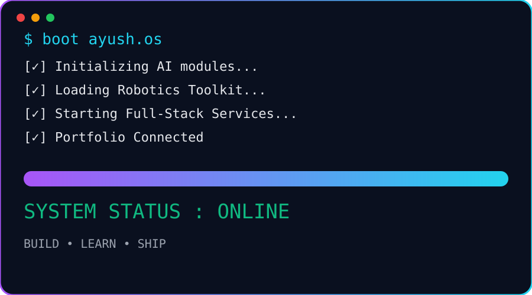

</p>

---

<p align="center">

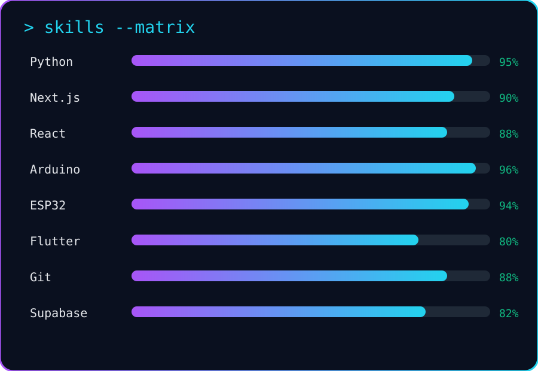

</p>

---
# 📊 GitHub Analytics

<p align="center">


</p>

---

# 🔥 GitHub Streak

<p align="center">


</p>

---

# 🏆 GitHub Trophies

<p align="center">


</p>

---

# 📈 Contribution Graph

<p align="center">


</p>

---

# 🐍 Contribution Snake

<p align="center">


</p>

---

# ⚡ Development Environment

| Category | Technologies |
|-----------|--------------|
| 💻 Languages | Python, C++, Dart, JavaScript |
| 🤖 Robotics | Arduino, ESP32, LiDAR, Sensors |
| 🌐 Frontend | React, Next.js, Tailwind CSS |
| 📱 Mobile | Flutter |
| 🛢 Backend | Firebase, Supabase |
| 🛠 Tools | Git, GitHub, VS Code |
| 🧠 AI | Computer Vision, Machine Learning, Prompt Engineering |

---

# 📌 Current Goals

- 🚀 Build production-ready AI applications
- 🤖 Develop intelligent robotics systems
- 🌐 Contribute to open-source projects
- 📚 Learn advanced AI and cloud technologies
- 💼 Secure opportunities in AI & Robotics
- 🏆 Participate in national hackathons
- ⚡ Ship impactful real-world projects

---
# 🚀 Featured Projects

---

## 🤖 A.E.G.I.S.

<p align="center">
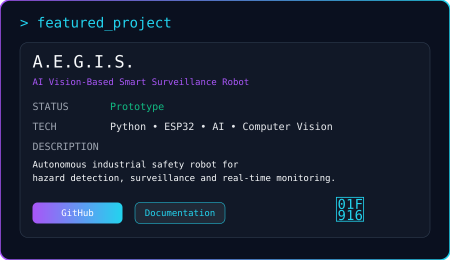
</p>

**AI Vision-Based Smart Surveillance Robot**

- 🧠 AI-powered industrial safety monitoring
- 👁️ Computer vision for hazard detection
- 📡 Real-time surveillance and alerts
- 🤖 Autonomous robotic navigation

**Tech Stack**

`Python` `ESP32` `Computer Vision` `AI` `IoT`

---

## 💰 FinNexa AI

<p align="center">
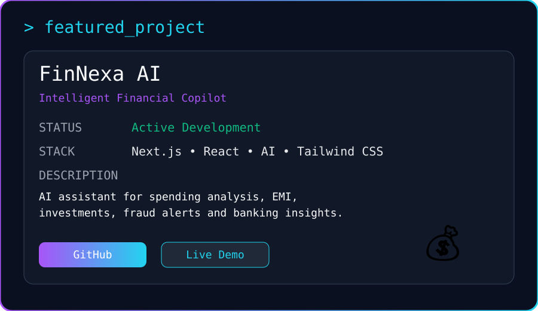
</p>

**Your Intelligent Financial Copilot**

- 📊 Spending analysis
- 💳 Banking assistant
- 📈 Investment suggestions
- 💰 EMI & Loan calculator
- 🛡 Fraud detection

**Tech Stack**

`Next.js` `React` `Tailwind CSS` `AI`

---

## 🚌 Temporary Bus Pass System

<p align="center">
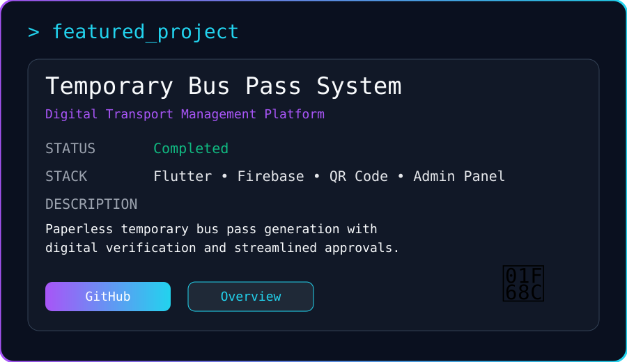
</p>

**Digital Transport Management Platform**

- 📱 QR-enabled temporary passes
- 🏫 College transport automation
- 📄 Paperless workflow
- ⚡ Fast approval process

**Tech Stack**

`Flutter` `Firebase` `QR Code`

---

## 🚗 AI Autonomous Driving Robot

<p align="center">
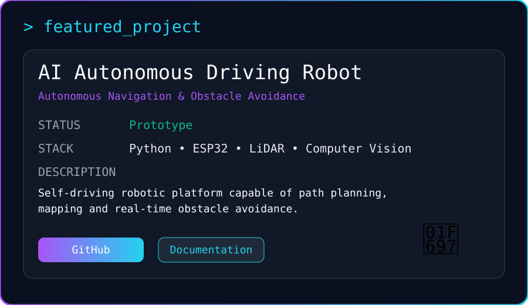
</p>

**Self Driving Robot**

- 🗺 Autonomous navigation
- 🚧 Obstacle avoidance
- 📡 Sensor fusion
- 🤖 Intelligent movement

**Tech Stack**

`ESP32` `Python` `LiDAR`

---

## 🗺️ LiDAR Mapping Robot

<p align="center">
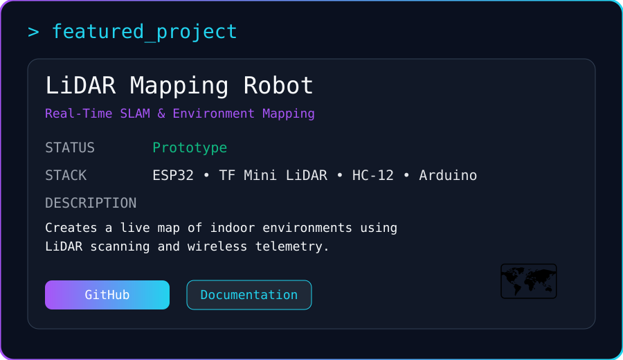
</p>

**Real-Time Mapping Robot**

- 📍 Environment mapping
- 📡 Wireless telemetry
- 🧭 Indoor navigation
- ⚡ Live visualization

**Tech Stack**

`ESP32` `Arduino` `TF Mini LiDAR`

---

## ✋ Hand Gesture Controlled Robot

<p align="center">
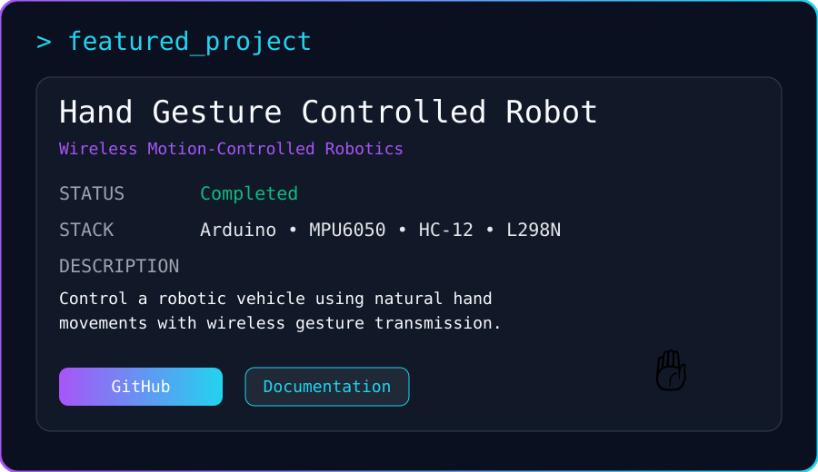
</p>

**Wireless Gesture Control**

- ✋ Motion-based control
- 📶 HC-12 communication
- 🤖 Robotic vehicle
- 🎮 Natural interaction

**Tech Stack**

`Arduino` `MPU6050` `HC-12`

---

## 📦 Stretch Wrapping Robot

<p align="center">
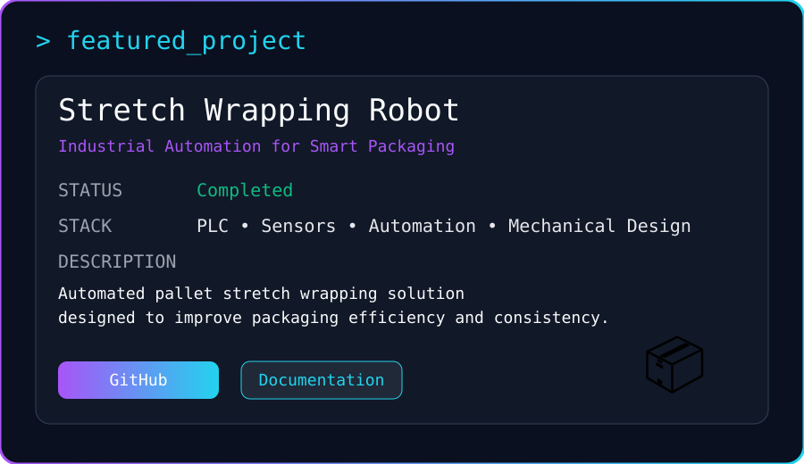
</p>

**Industrial Packaging Automation**

- 📦 Automated wrapping
- 🏭 Industrial automation
- ⚙️ PLC integration
- 📈 Improved efficiency

**Tech Stack**

`PLC` `Sensors` `Automation`

---

# 🌟 Achievements

🏆 District Chess 2nd Runner-Up

🥇 Hackathon Participant

🤖 Robotics Project Developer

💻 AI & Full-Stack Developer

🎯 Automation & Robotics Engineering Student

🌐 Open Source Learner

🚀 Building Real-World AI Solutions

---
# 📬 Connect With Me

<p align="center">

<a href="https://portfolio.ayushpatel.me">

</a>

<a href="https://github.com/ayushpatel2007">

</a>

<a href="https://www.linkedin.com/in/ayushpatel2037">

</a>

<a href="mailto:patelayush220@outlook.com">

</a>

</p>

---

# 🌍 Find Me Around the Web

| Platform | Link |
|----------|------|
| 🌐 Portfolio | https://portfolio.ayushpatel.me |
| 💼 LinkedIn | https://linkedin.com/in/ayushpatel2037 |
| 🐙 GitHub | https://github.com/ayushpatel2007 |
| 📧 Email | patelayush220@outlook.com |

---

# 💡 Favorite Quote

> **"The best way to predict the future is to build it."**

---

# 👀 Profile Views

<p align="center">


</p>

---

# ❤️ Thanks for Visiting

<p align="center">

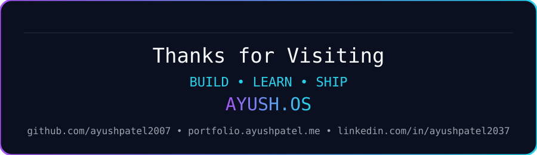

</p>

---

<p align="center">

### ⭐ If you like my work, consider starring my repositories!

</p>

<p align="center">

Made with ❤️ by **Ayush Patel**

</p>
